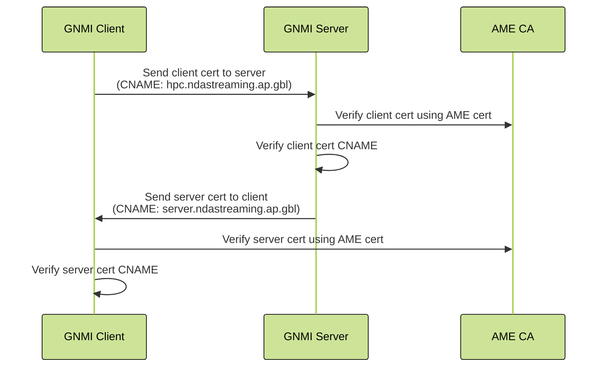

```mermaid
 %%{init: {'theme': 'forest', 'themeVariables': { 'actorBorder': '#000000', 'actorBackground': '#FFFFFF', 'actorTextColor': '#000000', 'actorFontSize': '14px', 'actorFontWeight': 'bold'}}}%%
sequenceDiagram
    participant GNMI_Client as GNMI Client
    participant GNMI_Server as GNMI Server
    participant AME_CA as AME CA

    GNMI_Client->>GNMI_Server: Send client cert to server<br>(CNAME: hpc.ndastreaming.ap.gbl)
    GNMI_Server->>AME_CA: Verify client cert using AME cert
    GNMI_Server->>GNMI_Server: Verify client cert CNAME

    GNMI_Server->>GNMI_Client: Send server cert to client<br>(CNAME: server.ndastreaming.ap.gbl) 
    GNMI_Client->>AME_CA: Verify server cert using AME cert
    GNMI_Client->>GNMI_Client: Verify server cert CNAME
```
