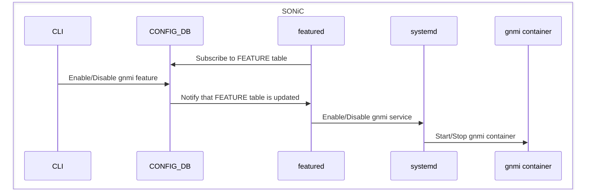

```mermaid
sequenceDiagram
    box SONiC
        participant CLI
        participant CONFIG_DB
        participant featured
        participant systemd
        participant gnmi container
    end
    featured->>CONFIG_DB: Subscribe to FEATURE table
    CLI->>CONFIG_DB: Enable/Disable gnmi feature
    CONFIG_DB->>featured: Notify that FEATURE table is updated
    featured->>systemd: Enable/Disable gnmi service
    systemd->>gnmi container: Start/Stop gnmi container
```
