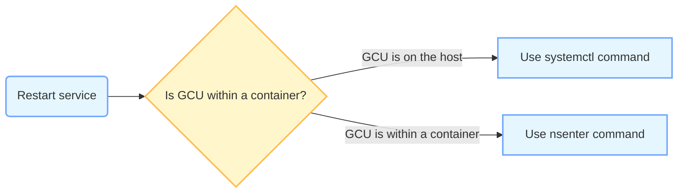

```mermaid
flowchart LR
    classDef process fill:#E5F6FF,stroke:#73A6FF,stroke-width:2px;
    classDef decision fill:#FFF6CC,stroke:#FFBC52,stroke-width:2px;
    Restart(Restart service):::process --> InContainer{Is GCU within a container?}:::decision
    InContainer --> |GCU is on the host|Systemctl[Use systemctl command]:::process
    InContainer --> |GCU is within a container|Nsenter[Use nsenter command]:::process
```
