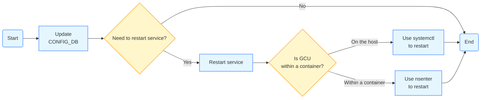

```mermaid
flowchart LR
    classDef process fill:#E5F6FF,stroke:#73A6FF,stroke-width:2px;
    classDef decision fill:#FFF6CC,stroke:#FFBC52,stroke-width:2px;
    Start(Start):::process --> UpdateDB[Update<br>CONFIG_DB]:::process
    UpdateDB --> UpdateService{Need to restart service?}:::decision
    UpdateService --> |No|End(End):::process
    UpdateService --> |Yes|Restart[Restart service]:::process
    Restart --> InContainer{Is GCU<br>within a container?}:::decision
    InContainer --> |On the host|Systemctl[Use systemctl<br>to restart]:::process
    InContainer --> |Within a container|Nsenter[Use nsenter<br>to restart]:::process
    Systemctl --> End
    Nsenter --> End
    %%linkStyle 0 stroke:#ff3,stroke-width:4px;
```
