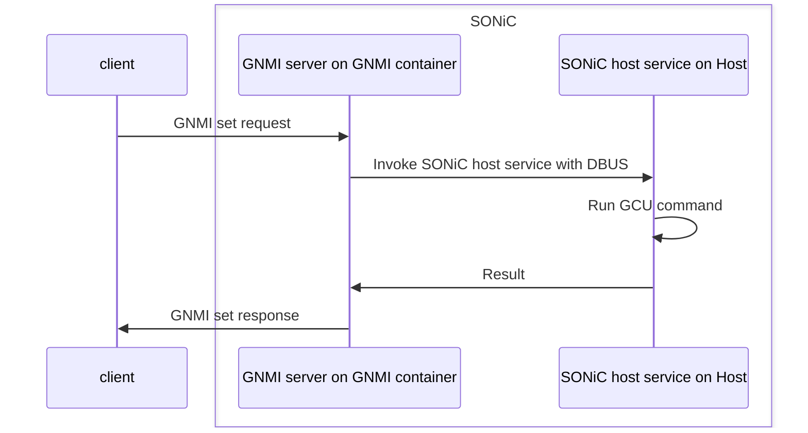

```mermaid
sequenceDiagram
    participant client
    box SONiC
        participant GNMI server on GNMI container
        participant SONiC host service on Host
    end
    client->>GNMI server on GNMI container: GNMI set request
    GNMI server on GNMI container->>SONiC host service on Host: Invoke SONiC host service with DBUS
    SONiC host service on Host->>SONiC host service on Host: Run GCU command
    SONiC host service on Host->>GNMI server on GNMI container: Result
    GNMI server on GNMI container->>client: GNMI set response
```
