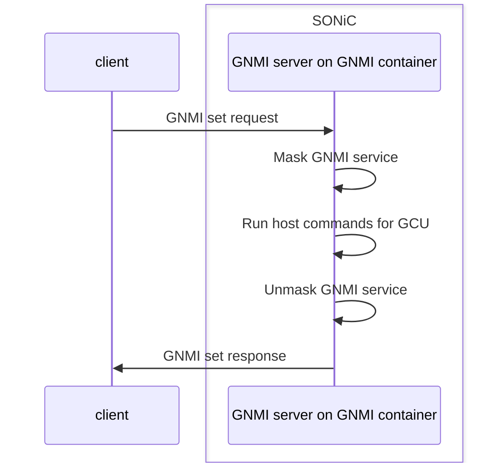

```mermaid
sequenceDiagram
    participant client
    box SONiC
        participant GNMI server on GNMI container
    end
    client->>GNMI server on GNMI container: GNMI set request
    GNMI server on GNMI container->>GNMI server on GNMI container: Mask GNMI service
    GNMI server on GNMI container->>GNMI server on GNMI container: Run host commands for GCU
    GNMI server on GNMI container->>GNMI server on GNMI container: Unmask GNMI service
    GNMI server on GNMI container->>client: GNMI set response
```
