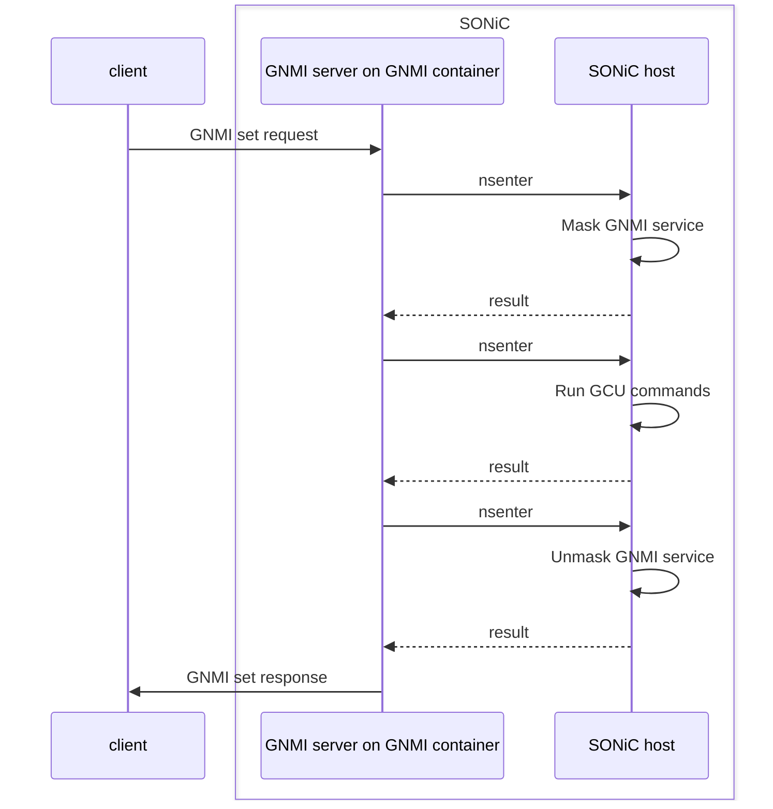

```mermaid
sequenceDiagram
    participant client
    box SONiC
        participant GNMI server on GNMI container
        participant SONiC host
    end
    client->>GNMI server on GNMI container: GNMI set request
    GNMI server on GNMI container->>SONiC host: nsenter
    SONiC host->>SONiC host: Mask GNMI service
    SONiC host-->>GNMI server on GNMI container: result
    GNMI server on GNMI container->>SONiC host: nsenter
    SONiC host->>SONiC host: Run GCU commands
    SONiC host-->>GNMI server on GNMI container: result
    GNMI server on GNMI container->>SONiC host: nsenter
    SONiC host->>SONiC host: Unmask GNMI service
    SONiC host-->>GNMI server on GNMI container: result
    GNMI server on GNMI container->>client: GNMI set response
```
