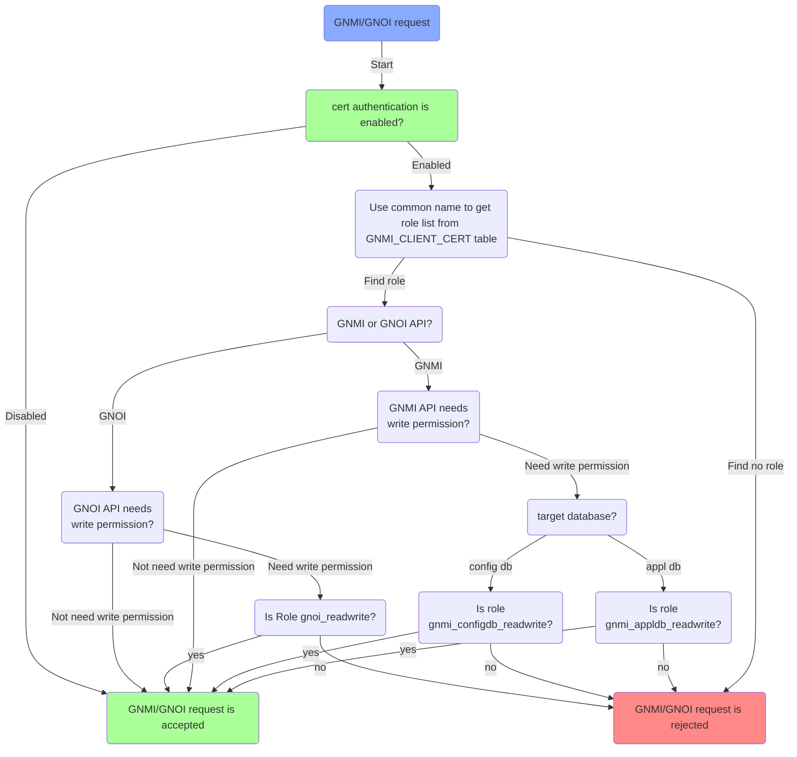

```mermaid
flowchart
    id_request(GNMI/GNOI request)
    style id_request fill:#8AF
    id_cert_auth(cert authentication is enabled?)
    style id_cert_auth fill:#AF9
    id_get_role(Use common name to get role list from GNMI_CLIENT_CERT table)
    id_api_type(GNMI or GNOI API?)
    id_gnoi_access(GNOI API needs<br>write permission?)
    id_gnmi_access(GNMI API needs<br>write permission?)
    id_gnmi_database(target database?)
    id_gnmi_configdb_role(Is role<br>gnmi_configdb_readwrite?)
    id_gnmi_appldb_role(Is role<br>gnmi_appldb_readwrite?)
    id_gnoi_role(Is Role gnoi_readwrite?)
    id_request_auth(GNMI/GNOI request is accepted)
    style id_request_auth fill:#AF9
    id_request_not_auth(GNMI/GNOI request is rejected)
    style id_request_not_auth fill:#F88

    id_request-->|Start|id_cert_auth
    id_cert_auth-->|Disabled|id_request_auth
    id_cert_auth-->|Enabled|id_get_role
    id_get_role-->|Find role|id_api_type
    id_api_type-->|GNOI|id_gnoi_access
    id_api_type-->|GNMI|id_gnmi_access
    id_gnoi_access-->|Need write permission|id_gnoi_role
    id_gnoi_access-->|Not need write permission|id_request_auth
    id_gnoi_role-->|yes|id_request_auth
    id_gnoi_role-->|no|id_request_not_auth
    id_gnmi_access-->|Not need write permission|id_request_auth
    id_gnmi_access-->|Need write permission|id_gnmi_database
    id_gnmi_database-->|config db|id_gnmi_configdb_role
    id_gnmi_database-->|appl db|id_gnmi_appldb_role
    id_gnmi_configdb_role-->|yes|id_request_auth
    id_gnmi_configdb_role-->|no|id_request_not_auth
    id_gnmi_appldb_role-->|yes|id_request_auth
    id_gnmi_appldb_role-->|no|id_request_not_auth
    id_get_role-->|Find no role|id_request_not_auth
```
