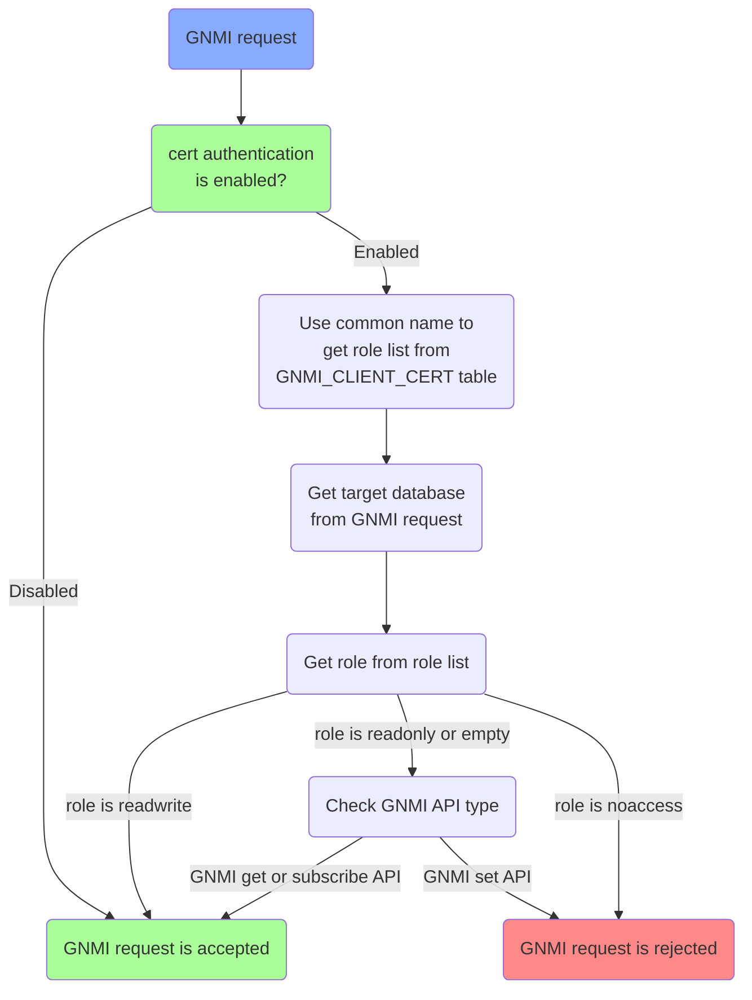

```mermaid
flowchart
    id_request(GNMI request)
    style id_request fill:#8AF
    id_cert_auth(cert authentication<br>is enabled?)
    style id_cert_auth fill:#AF9
    id_get_role_list(Use common name to<br>get role list from<br>GNMI_CLIENT_CERT table)
    id_gnmi_access(Get target database<br>from GNMI request)
    id_get_role(Get role from role list)
    id_api_type(Check GNMI API type)
    id_request_auth(GNMI request is accepted)
    style id_request_auth fill:#AF9
    id_request_not_auth(GNMI request is rejected)
    style id_request_not_auth fill:#F88

    id_request-->id_cert_auth
    id_cert_auth-->|Disabled|id_request_auth
    id_cert_auth-->|Enabled|id_get_role_list
    id_get_role_list-->id_gnmi_access
    id_gnmi_access-->id_get_role
    id_get_role-->|role is readwrite|id_request_auth
    id_get_role-->|role is readonly or empty|id_api_type
    id_api_type-->|GNMI set API|id_request_not_auth
    id_get_role-->|role is noaccess|id_request_not_auth
    id_api_type-->|GNMI get or subscribe API|id_request_auth
```
