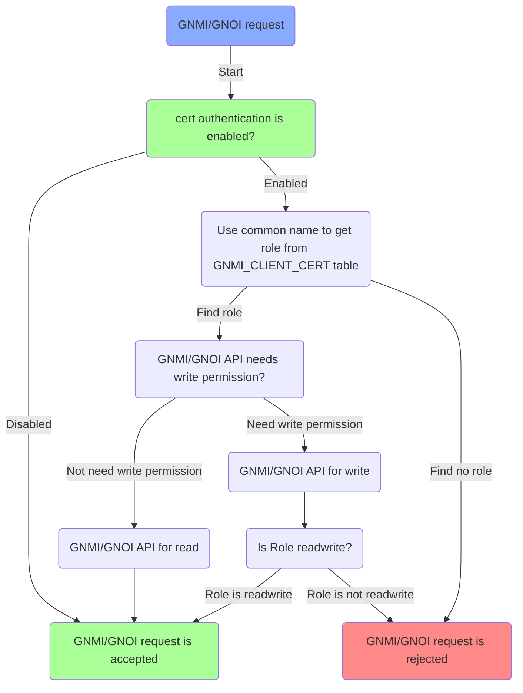

```mermaid
flowchart
    id_request(GNMI/GNOI request)
    style id_request fill:#8AF
    id_cert_auth(cert authentication is enabled?)
    style id_cert_auth fill:#AF9
    id_get_role(Use common name to get role from GNMI_CLIENT_CERT table)
    id_api_access(GNMI/GNOI API needs write permission?)
    id_api_write(GNMI/GNOI API for write)
    id_api_read(GNMI/GNOI API for read)
    id_check_role(Is Role readwrite?)
    id_request_auth(GNMI/GNOI request is accepted)
    style id_request_auth fill:#AF9
    id_request_not_auth(GNMI/GNOI request is rejected)
    style id_request_not_auth fill:#F88

    id_request-->|Start|id_cert_auth
    id_cert_auth-->|Disabled|id_request_auth
    id_cert_auth-->|Enabled|id_get_role
    id_get_role-->|Find role|id_api_access
    id_api_access-->|Need write permission|id_api_write
    id_api_access-->|Not need write permission|id_api_read
    id_api_read-->id_request_auth
    id_api_write-->id_check_role
    id_check_role-->|Role is not readwrite|id_request_not_auth
    id_check_role-->|Role is readwrite|id_request_auth
    id_get_role-->|Find no role|id_request_not_auth
```
