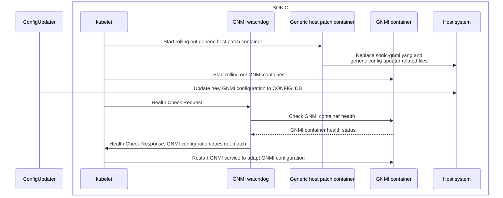

```mermaid
sequenceDiagram
    participant ConfigUpdater
    box SONiC
        participant kubelet
        participant GNMI watchdog
        participant Generic host patch container
        participant GNMI container
        participant Host system
    end
    kubelet->>Generic host patch container: Start rolling out generic host patch container
    Generic host patch container->>Host system: Replace sonic-gnmi.yang and <br>generic config updater related files
    kubelet->>GNMI container: Start rolling out GNMI container
    ConfigUpdater->>Host system: Update new GNMI configuration to CONFIG_DB
    kubelet->>GNMI watchdog: Health Check Request
    GNMI watchdog->>GNMI container: Check GNMI container health
    GNMI container-->>GNMI watchdog: GNMI container health status
    GNMI watchdog->>kubelet: Health Check Response, GNMI configuration does not match
    kubelet->>GNMI container: Restart GNMI service to adapt GNMI configuration
```
