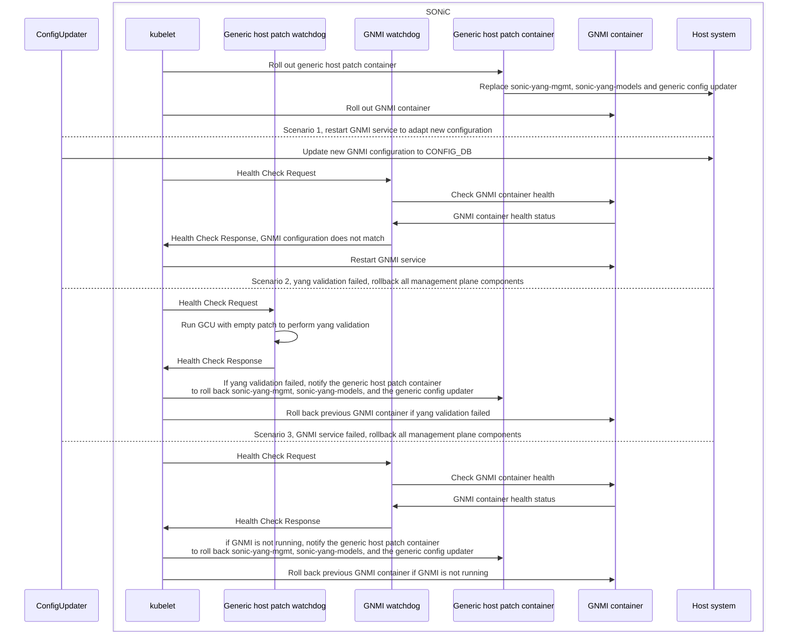

```mermaid
sequenceDiagram
    participant ConfigUpdater
    box SONiC
        participant kubelet
        participant Generic host patch watchdog
        participant GNMI watchdog
        participant Generic host patch container
        participant GNMI container
        participant Host system
    end
    kubelet->>Generic host patch container: Roll out generic host patch container
    Generic host patch container->>Host system: Replace sonic-yang-mgmt, sonic-yang-models and generic config updater
    kubelet->>GNMI container: Roll out GNMI container
    ConfigUpdater-->Host system: Scenario 1, restart GNMI service to adapt new configuration
    ConfigUpdater->>Host system: Update new GNMI configuration to CONFIG_DB
    kubelet->>GNMI watchdog: Health Check Request
    GNMI watchdog->>GNMI container: Check GNMI container health
    GNMI container->>GNMI watchdog: GNMI container health status
    GNMI watchdog->>kubelet: Health Check Response, GNMI configuration does not match
    kubelet->>GNMI container: Restart GNMI service
    ConfigUpdater-->Host system: Scenario 2, yang validation failed, rollback all management plane components
    kubelet->>Generic host patch watchdog: Health Check Request
    Generic host patch watchdog->>Generic host patch watchdog: Run GCU with empty patch to perform yang validation
    Generic host patch watchdog->>kubelet: Health Check Response
    kubelet->>Generic host patch container: If yang validation failed, notify the generic host patch container <br>to roll back sonic-yang-mgmt, sonic-yang-models, and the generic config updater
    kubelet->>GNMI container: Roll back previous GNMI container if yang validation failed
    ConfigUpdater-->Host system: Scenario 3, GNMI service failed, rollback all management plane components
    kubelet->>GNMI watchdog: Health Check Request
    GNMI watchdog->>GNMI container: Check GNMI container health
    GNMI container->>GNMI watchdog: GNMI container health status
    GNMI watchdog->>kubelet: Health Check Response
    kubelet->>Generic host patch container: if GNMI is not running, notify the generic host patch container <br>to roll back sonic-yang-mgmt, sonic-yang-models, and the generic config updater
    kubelet->>GNMI container: Roll back previous GNMI container if GNMI is not running
```
