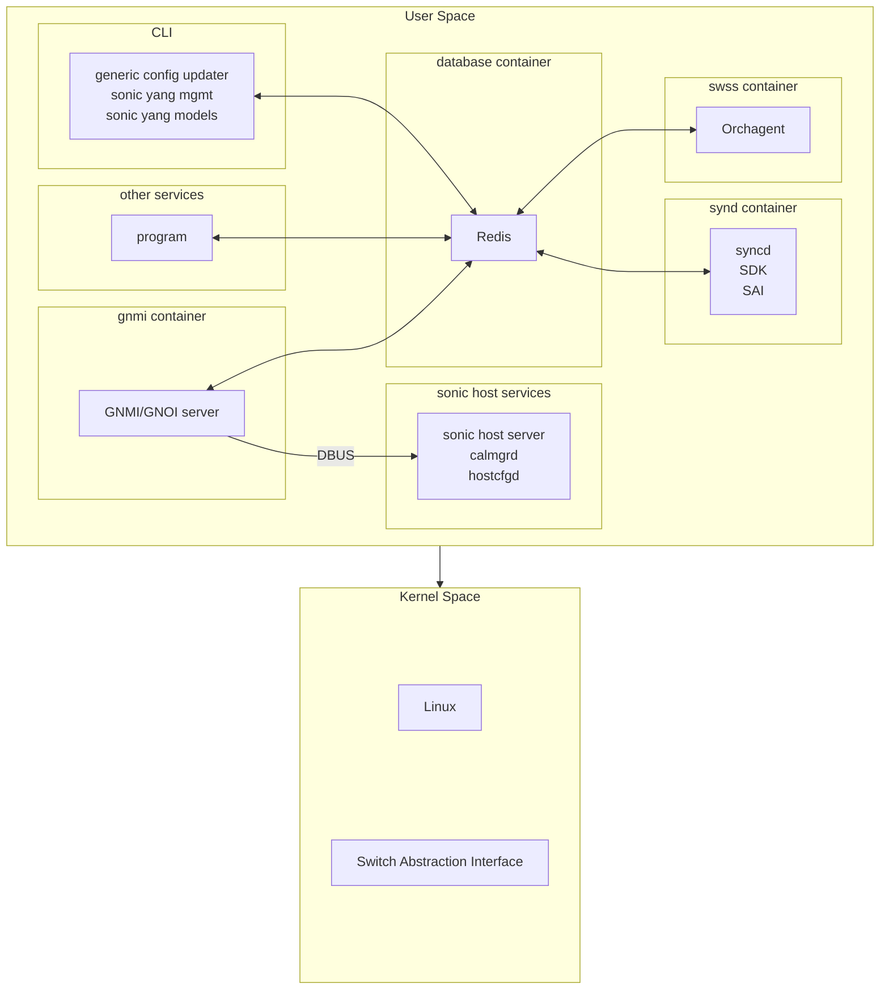

```mermaid
flowchart TD
    subgraph UserSpace[User Space]
        subgraph gnmi container
            gnmi[GNMI/GNOI server]
        end
        subgraph sonic host services
            hostServices[sonic host server<br>calmgrd<br>hostcfgd]
        end
        subgraph other services
            program
        end
        subgraph swss container
            orchagent[Orchagent]
        end
        subgraph database container
            Redis[Redis]
        end
        subgraph synd container
            syncd[syncd<br>SDK<br>SAI]
        end
        subgraph CLI
            GCU[generic config updater<br>sonic yang mgmt<br>sonic yang models]
        end
        gnmi <--> Redis
        gnmi --> |DBUS|hostServices
        program <--> Redis
        GCU <--> Redis
        Redis <--> orchagent
        Redis <--> syncd
    end
    subgraph KernelSpace[Kernel Space]
        KernelA[ ]
        Linux[Linux]
        KernelB[ ]
        SAI[Switch Abstraction Interface]
        KernelC[ ]
        style KernelA visibility:hidden
        style KernelB visibility:hidden
        style KernelC visibility:hidden
    end
    UserSpace --> KernelSpace
```
