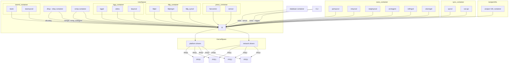

```mermaid
flowchart TD
    subgraph UserSpace
        A[dhcp - relay container] -->|dhcrelay| B
        subgraph pmon_container
            C[fancontrol]
            D[sensor]
        end
        E[snmp container] -->|snmpd, snmp_subagent| B
        subgraph lldp_container
            F[lldpd]
            G[lldpmgrd]
            H[lldp_syncd]
        end
        subgraph bgp_container
            I[bgpd]
            J[zebra]
            K[fpsyncd]
        end
        subgraph teamd_container
            L[team]
            M[teamsyncd]
        end
    end
    subgraph swss_container
        N[portsyncd]
        O[intsyncd]
        P[neighsyncd]
        Q[orchagent]
        R[intfmgrd]
        S[vlanmgrd]
    end
    T[database container] -->|redis - server| B
    subgraph sync_container
        U[syncd]
        V[sai api]
    end
    subgraph JuniperHAL
        W[Juniper HAL container]
    end
    X[CLI] -->|sonic - cfggen| B
    subgraph KernelSpace
        Y[platform drivers]
        Z[network drivers]
    end
    A --> B
    C --> B
    D --> B
    E --> B
    F --> B
    G --> B
    H --> B
    I --> B
    J --> B
    K --> B
    L --> B
    M --> B
    N --> B
    O --> B
    P --> B
    Q --> B
    R --> B
    S --> B
    U --> B
    V --> B
    W --> B
    X --> B
    B --> Y
    B --> Z
    Y -->|PFE0| a[PFE0]
    Y -->|PFE1| b[PFE1]
    Y -->|PFE2| c[PFE2]
    Y -->|PFE3| d[PFE3]
    Z -->|PFE0| a
    Z -->|PFE1| b
    Z -->|PFE2| c
    Z -->|PFE3| d
```
