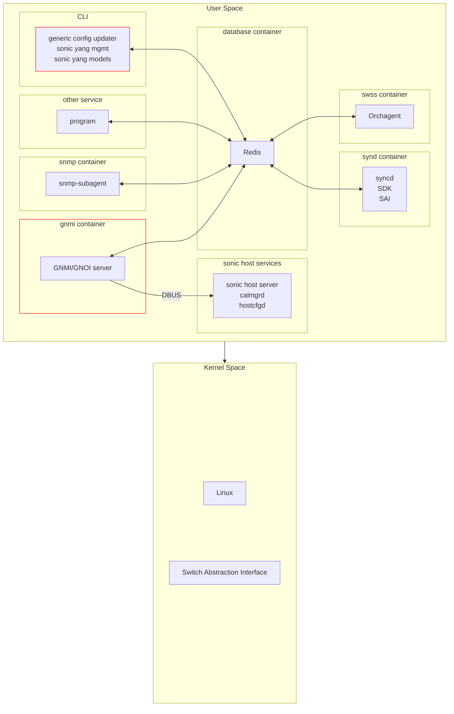

```mermaid
flowchart TD
    classDef management stroke:#FF0000;
    subgraph UserSpace[User Space]
        subgraph gnmiContainer[gnmi container]
            gnmi[GNMI/GNOI server]
        end
        style gnmiContainer stroke:#FF0000;
        subgraph sonic host services
            hostServices[sonic host server<br>calmgrd<br>hostcfgd]
        end
        subgraph snmp container
            snmp-subagent
        end
        subgraph other service
            program
        end
        subgraph swss container
            orchagent[Orchagent]
        end
        subgraph database container
            Redis[Redis]
        end
        subgraph synd container
            syncd[syncd<br>SDK<br>SAI]
        end
        subgraph CLI
            GCU[generic config updater<br>sonic yang mgmt<br>sonic yang models]:::management
        end
        gnmi <--> Redis
        gnmi --> |DBUS|hostServices
        snmp-subagent <--> Redis
        program <--> Redis
        GCU <--> Redis
        Redis <--> orchagent
        Redis <--> syncd
    end
    subgraph KernelSpace[Kernel Space]
        KernelA[ ]
        KernelB[ ]
        KernelC[ ]
        Linux[Linux]
        KernelD[ ]
        SAI[Switch Abstraction Interface]
        KernelE[ ]
        KernelF[ ]
        KernelG[ ]
        style KernelA visibility:hidden
        style KernelB visibility:hidden
        style KernelC visibility:hidden
        style KernelD visibility:hidden
        style KernelE visibility:hidden
        style KernelF visibility:hidden
        style KernelG visibility:hidden
    end
    UserSpace --> KernelSpace
```
