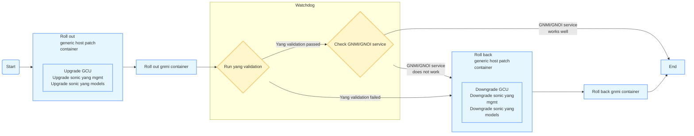

```mermaid
flowchart LR
    classDef process fill:#E5F6FF,stroke:#73A6FF,stroke-width:2px;
    classDef decision fill:#FFF6CC,stroke:#FFBC52,stroke-width:2px;
    subgraph RolloutGeneric[Roll out<br>generic host patch<br>container]
        direction LR
        HiddenA[ ]
        UpgradeGCU[Upgrade GCU<br>Upgrade sonic yang mgmt<br>Upgrade sonic yang models]:::process
        style HiddenA visibility:hidden
    end
    subgraph RollbackGeneric[Roll back<br>generic host patch<br>container]
        direction LR
        HiddenB[ ]
        DowngradeGCU[Downgrade GCU<br>Downgrade sonic yang<br>mgmt<br>Downgrade sonic yang<br>models]:::process
        style HiddenB visibility:hidden
    end
    subgraph Watchdog
        WatchdogGCU{Run yang validation}
        WatchdogGNMI{Check GNMI/GNOI service}
    end
    Start(Start):::process --> RolloutGeneric:::process
    RolloutGeneric --> RolloutGNMI[Roll out gnmi container]:::process
    RolloutGNMI --> WatchdogGCU:::decision
    WatchdogGCU --> |Yang validation passed|WatchdogGNMI:::decision
    WatchdogGCU --> |Yang validation failed|RollbackGeneric:::process
    WatchdogGNMI --> |GNMI/GNOI service<br>works well|End[End]:::process
    WatchdogGNMI --> |GNMI/GNOI service<br>does not work|RollbackGeneric:::process
    RollbackGeneric --> RollbackGNMI[Roll back gnmi container]:::process
    RollbackGNMI -->End
```
