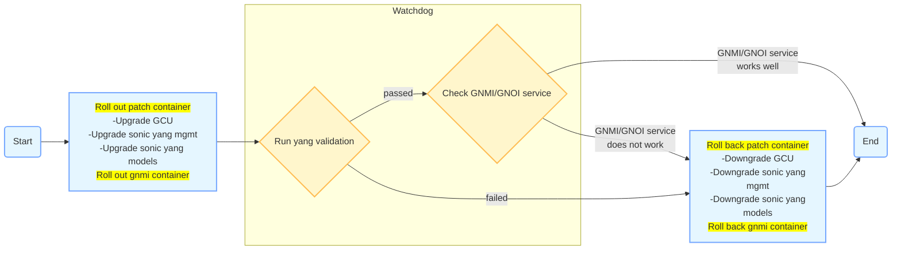

```mermaid
graph LR
    classDef process fill:#E5F6FF,stroke:#73A6FF,stroke-width:2px;
    classDef decision fill:#FFF6CC,stroke:#FFBC52,stroke-width:2px;
    RolloutGeneric[<span style="background-color: yellow;">Roll out patch container</span><br>-Upgrade GCU<br>-Upgrade sonic yang mgmt<br>-Upgrade sonic yang models<br></span><span style="background-color: yellow;">Roll out gnmi container</span>]
    RollbackGeneric[<span style="background-color: yellow;">Roll back patch container</span><br>-Downgrade GCU<br>-Downgrade sonic yang<br>mgmt<br>-Downgrade sonic yang<br>models<br><span style="background-color: yellow;">Roll back gnmi container</span>]
    subgraph Watchdog
        WatchdogGCU{Run yang validation}
        WatchdogGNMI{Check GNMI/GNOI service}
    end
    Start(Start):::process --> RolloutGeneric:::process
    RolloutGeneric --> WatchdogGCU:::decision
    WatchdogGCU --> |passed|WatchdogGNMI:::decision
    WatchdogGCU --> |failed|RollbackGeneric:::process
    WatchdogGNMI --> |GNMI/GNOI service<br>works well|End[End]:::process
    WatchdogGNMI --> |GNMI/GNOI service<br>does not work|RollbackGeneric:::process
    RollbackGeneric --> End(End):::process
```
