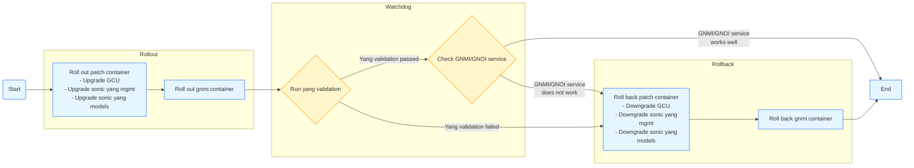

```mermaid
flowchart LR
    classDef process fill:#E5F6FF,stroke:#73A6FF,stroke-width:2px;
    classDef decision fill:#FFF6CC,stroke:#FFBC52,stroke-width:2px;
    subgraph Rollout
        direction TB
        RolloutGeneric[Roll out patch container<BR>- Upgrade GCU<br>- Upgrade sonic yang mgmt<br>- Upgrade sonic yang models]
        RolloutGNMI[Roll out gnmi container]
    end
    subgraph Rollback
        direction TB
        RollbackGeneric[Roll back patch container<br>- Downgrade GCU<br>- Downgrade sonic yang<br>mgmt<br>- Downgrade sonic yang<br>models]
        RollbackGNMI[Roll back gnmi container]
    end
    subgraph Watchdog
        direction TB
        WatchdogGCU{Run yang validation}
        WatchdogGNMI{Check GNMI/GNOI service}
    end
    Start(Start):::process --> RolloutGeneric:::process
    RolloutGeneric --> RolloutGNMI:::process
    RolloutGNMI --> WatchdogGCU:::decision
    WatchdogGCU --> |Yang validation passed|WatchdogGNMI:::decision
    WatchdogGCU --> |Yang validation failed|RollbackGeneric:::process
    WatchdogGNMI --> |GNMI/GNOI service<br>works well|End[End]:::process
    WatchdogGNMI --> |GNMI/GNOI service<br>does not work|RollbackGeneric:::process
    RollbackGeneric --> RollbackGNMI:::process
    RollbackGNMI -->End
```
