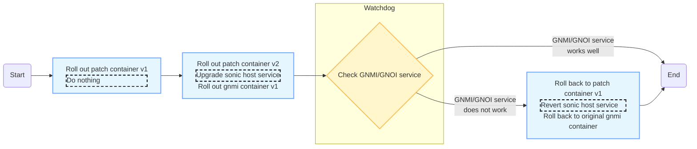

```mermaid
graph LR
    classDef process fill:#E5F6FF,stroke:#73A6FF,stroke-width:2px;
    classDef decision fill:#FFF6CC,stroke:#FFBC52,stroke-width:2px;
    RolloutInit[Roll out patch container v1<br><div style="margin-left:0px;border:2px dashed black;padding:0px;text-align:left;">Do nothing</div>]
    RolloutGeneric[Roll out patch container v2<br><div style="margin-left:0px;border:2px dashed black;padding:0px;text-align:left;">Upgrade sonic host service</div>Roll out gnmi container v1]
    RollbackGeneric[Roll back to patch container v1<br><div style="margin-left:0px;border:2px dashed black;padding:0px;text-align:left;">Revert sonic host service</div>Roll back to original gnmi container]
    subgraph Watchdog
        WatchdogGNMI{Check GNMI/GNOI service}
    end
    Start(Start) --> RolloutInit:::process
    RolloutInit --> RolloutGeneric:::process
    RolloutGeneric --> WatchdogGNMI:::decision
    WatchdogGNMI --> |GNMI/GNOI service<br>works well|End(End)
    WatchdogGNMI --> |GNMI/GNOI service<br>does not work|RollbackGeneric:::process
    RollbackGeneric --> End
```
