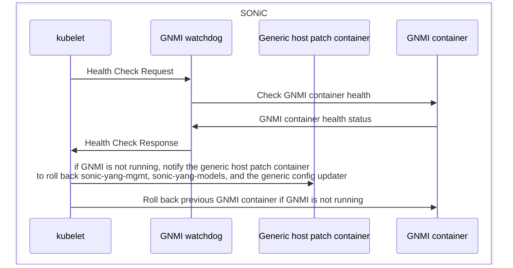

```mermaid
sequenceDiagram
    box SONiC
        participant kubelet
        participant GNMI watchdog
        participant Generic host patch container
        participant GNMI container
    end
    kubelet->>GNMI watchdog: Health Check Request
    GNMI watchdog->>GNMI container: Check GNMI container health
    GNMI container->>GNMI watchdog: GNMI container health status
    GNMI watchdog->>kubelet: Health Check Response
    kubelet->>Generic host patch container: if GNMI is not running, notify the generic host patch container <br>to roll back sonic-yang-mgmt, sonic-yang-models, and the generic config updater
    kubelet->>GNMI container: Roll back previous GNMI container if GNMI is not running
```
