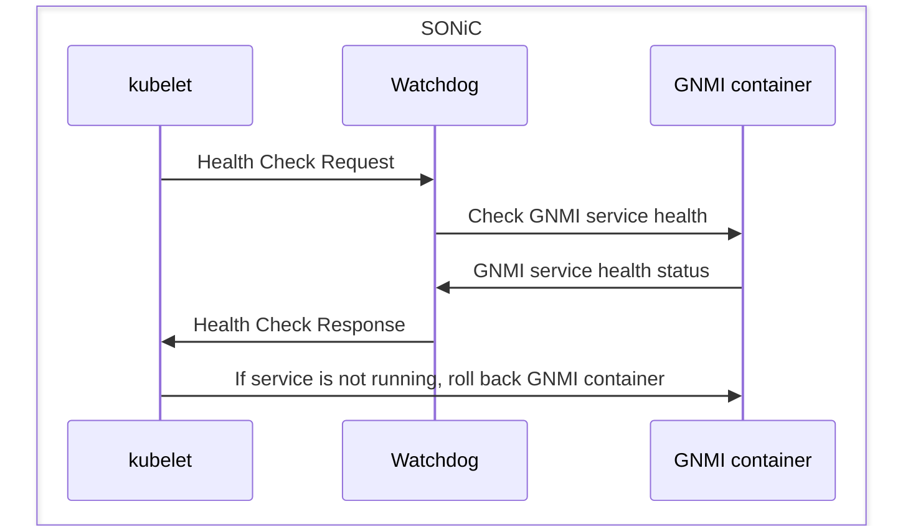

```mermaid
sequenceDiagram
    box SONiC
        participant kubelet
        participant Watchdog
        participant GNMI container
    end
    kubelet->>Watchdog: Health Check Request
    Watchdog->>GNMI container: Check GNMI service health
    GNMI container->>Watchdog: GNMI service health status
    Watchdog->>kubelet: Health Check Response
    kubelet->>GNMI container: If service is not running, roll back GNMI container
```
