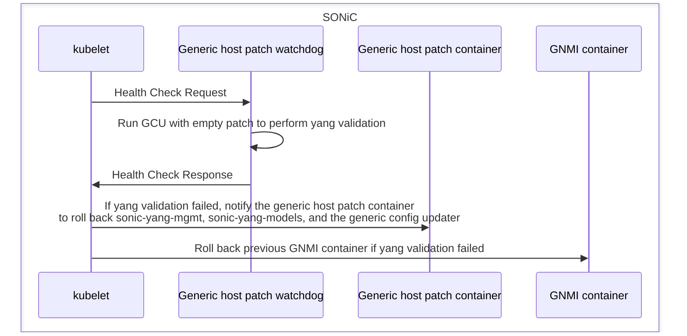

```mermaid
sequenceDiagram
    box SONiC
        participant kubelet
        participant Generic host patch watchdog
        participant Generic host patch container
        participant GNMI container
    end
    kubelet->>Generic host patch watchdog: Health Check Request
    Generic host patch watchdog->>Generic host patch watchdog: Run GCU with empty patch to perform yang validation
    Generic host patch watchdog->>kubelet: Health Check Response
    kubelet->>Generic host patch container: If yang validation failed, notify the generic host patch container <br>to roll back sonic-yang-mgmt, sonic-yang-models, and the generic config updater
    kubelet->>GNMI container: Roll back previous GNMI container if yang validation failed
```
